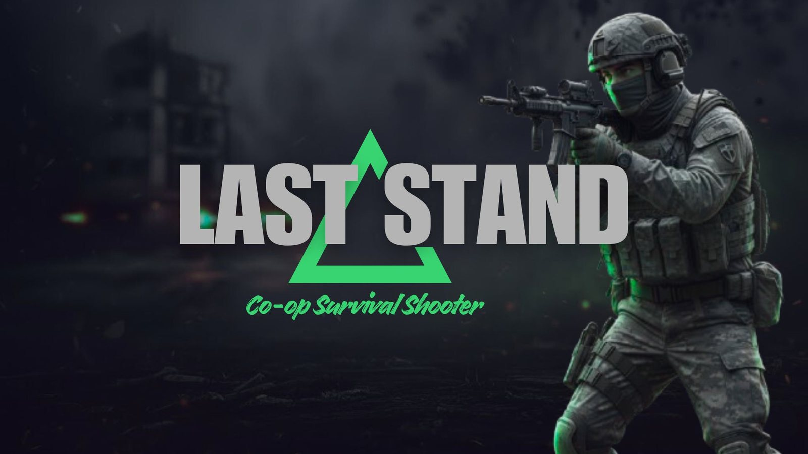
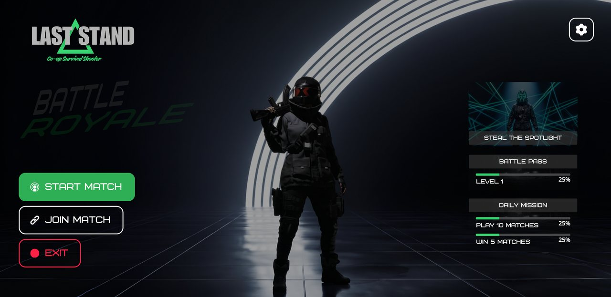
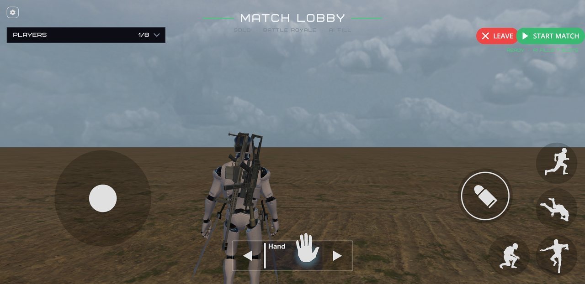
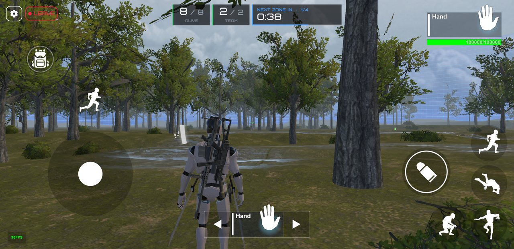
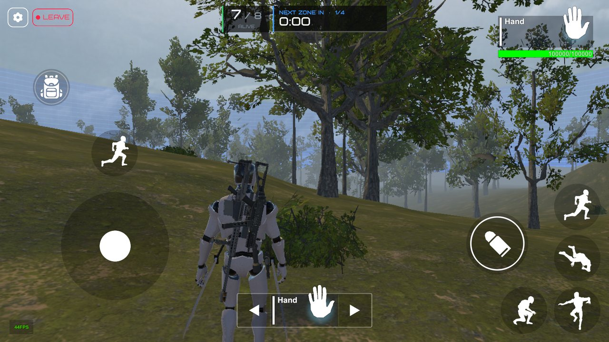
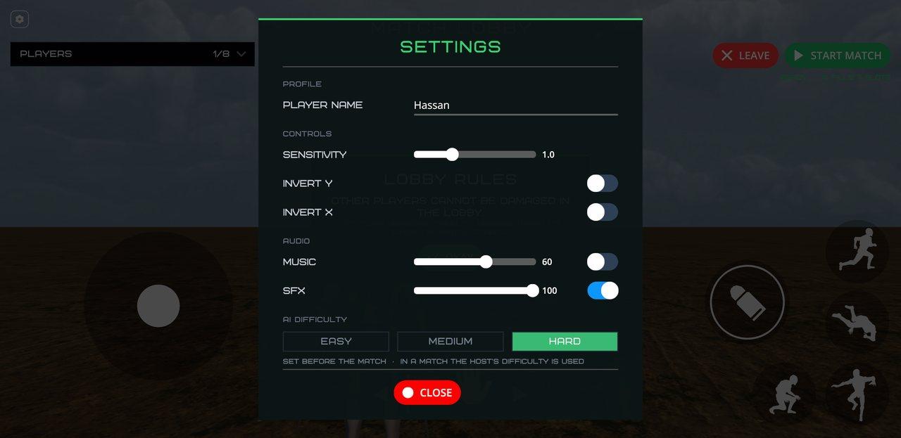
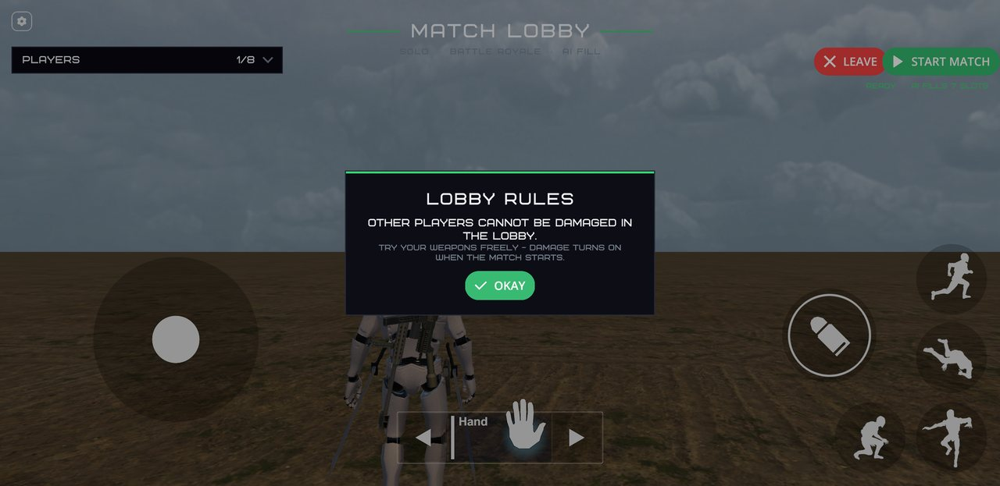

<div align="center">



# Last Stand: Co-op Survival Shooter

**An offline battle royale for Android. Play with friends, no internet needed.**


</div>

---

## Screenshots

<table>
  <tr>
    <td width="50%"><br><sub><b>Main menu</b> – host a match or join a friend</sub></td>
    <td width="50%"><br><sub><b>Lobby</b> – see who joined, get ready, try your weapons</sub></td>
  </tr>
  <tr>
    <td width="50%"><br><sub><b>In a match</b> – players alive, your team, and the next zone at the top</sub></td>
    <td width="50%"><br><sub><b>The map</b> – a forest with the safe zone wall behind the trees</sub></td>
  </tr>
  <tr>
    <td width="50%"><br><sub><b>Settings</b> – controls, sound and AI difficulty</sub></td>
    <td width="50%"><br><sub><b>Lobby rules</b> – nobody gets hurt before the match starts</sub></td>
  </tr>
</table>

---

## About

A battle royale game for Android phones that you can play with friends **without internet**.
One phone hosts the match, and up to three friends join it over a mobile hotspot or Wi-Fi.
Empty spots are filled with AI bots, so a match is never empty.

This is our Final Year Project (BS IT, 2022–2026) at Akhuwat College Kasur, University of the Punjab.

- **Students:** Muhammad Tayyab Saleem, Akbar Jahangir
- **Supervisor:** Muhammad Naeem Akhtar

---

## What the game has

- **Offline multiplayer** – 1 to 4 players over LAN or hotspot. No 4G, no router, no server.
- **Three modes** – Solo, Duo and Squad. Teammates can't hurt each other.
- **AI bots** – they fill empty slots, look for enemies, fight, and follow the safe zone.
  The host picks the difficulty: Easy, Medium or Hard.
- **Shrinking safe zone** – stay inside the circle or you lose health every second.
- **Loot** – ammo and health power-ups all over the map, with more added every 2 minutes.
- **Awareness ring** – shows where gunfire (up to 200 m) and footsteps (up to 80 m) come from,
  and who is shooting you.
- **Team box** – in Duo and Squad the top bar shows how many of your teammates are still alive.
- **Auto heal** – after 60 seconds without damage, your health slowly comes back.
- **Lobby** – walk around and try your weapons before the match. Nobody can be hurt in the lobby.
- **Built for phones** – low-end phones are detected and run a steady 45 FPS with lighter graphics.
  Other phones run at 60 FPS.

---

## How to play

1. **Host:** tap **START MATCH**, pick a mode (Solo, Duo or Squad), tick **Fill with AI** if you want bots,
   and tap **Host Match**. Your friends need to be on your hotspot or the same Wi-Fi.
2. **Join:** tap **JOIN MATCH** and pick the host's game from the list.
3. In the lobby, everyone presses **READY**. Then the host presses **START MATCH**.
4. Find weapons and power-ups, stay inside the safe zone, and be the last player (or team) alive.

---

## Controls

**On the phone:** touch controls – joystick to move, drag the screen to look, and buttons to
shoot, jump, crouch, roll and sprint.

**In the Unity editor (keyboard and mouse):**

| Action | Key |
|---|---|
| Move | W A S D |
| Look | Mouse |
| Shoot / Aim | Left click / Right click |
| Run | Shift |
| Jump | Space |
| Crouch / Prone / Roll | C / Z / Ctrl |
| Reload | R |
| Next / previous weapon | E / Q |
| Pick a weapon slot | 1 – 9, 0 |
| Inventory | Tab |
| Pick up / Use | F |

You can switch the editor between keyboard and touch controls in
**Tools › Last Stand › Editor Test Settings**.

---

## Getting started (for developers)

**You need:** Unity **6000.3.5f2** with the Android Build Support module.

1. Clone the project and open it in Unity Hub.
2. Open `Assets/Scenes/MenuScene.unity` and press **Play**.
3. The scenes run in this order: **MenuScene → LobbyScene → GameScene**.

**Test multiplayer on one computer:** the project includes **ParrelSync**. Open
**ParrelSync › Clones Manager**, open the clone in a second Unity window, host in one window
and join from the other.

**Build for Android:** File › Build Profiles › Android › Build. The game is 64-bit (ARM64) and uses IL2CPP.

**Note:** the intro video plays only once. To see it again in the editor, delete the
`IntroVideoPlayed` key from PlayerPrefs.

---

## Where to change settings

Most gameplay values are in the Inspector, so you can change them without touching code.

| What | Where |
|---|---|
| Bot skill (this is the "Hard" level), detect/fire range, names | LobbyScene › `LSMatchManager` › **AI Players** |
| Loot amount and how often new loot comes | LobbyScene › `LSMatchManager` › **Loot** |
| How far apart teams start | LobbyScene › `LSMatchManager` › **Spawning** |
| Awareness ring ranges and colours | GameScene › `EnemyAwarenessHUD` |
| Safe zone stages, speed and damage | GameScene › `SafeZoneController` |
| Auto heal delay and speed | `Prefabs/Character.prefab` › `PlayerHealthManager` › **Auto Heal** |
| Jump height and sprint speed | `Prefabs/Character.prefab` › `JUCharacterController` |
| Weapon recoil | `Prefabs/Character.prefab` › the weapon (e.g. UMP) › `Weapon` › **Recoil Strength** |
| Intro video | `Assets/Resources/IntroVideoConfig` |
| Forest (trees and bushes) | **Tools › Last Stand › Build Forest** |

Players pick the AI difficulty in the game's **Settings** before a match. In a match the host's choice is used.

---

## Project folders

```
Assets/
  Scenes/          MenuScene, LobbyScene, GameScene
  Scripts/Game/    Match flow, players, bots, safe zone, networking, performance
  Scripts/UI/      Menus, lobby, HUD, settings, intro video
  Prefabs/         Player character and power-ups
  Forest/          Optimised trees and bushes for the map
  Last Stand UI/   Game art, icons and HUD images
  Resources/       Settings loaded at start (intro video, editor test settings)
  Video/           Intro video
  Other Packs/     Third-party assets (see below)
```

Main scripts:

- `LSMatchManager` – lobby, teams, match start, bots, loot and spawn points
- `LSBotBrain` – how an AI bot thinks and moves
- `MatchTracker` – who is alive and who wins
- `SafeZoneController` – the shrinking zone
- `PlayerHealthManager` – damage, death and auto heal (decided by the host)
- `LSPerformanceBootstrap` – frame rate, low-end phone mode and resolution scaling

---

## Built with

- **Unity 6** and **C#**, Universal Render Pipeline (URP)
- **Mirror** – networking over LAN / hotspot
- **JU TPS Controller** – third-person character, weapons and mobile controls
- **Modern UI Pack** – menu buttons, sliders and switches
- **ParrelSync** – test multiplayer with two editor windows
- World Environment Packs – map art

The third-party assets in `Assets/Other Packs` belong to their owners and are used under their own licences.
